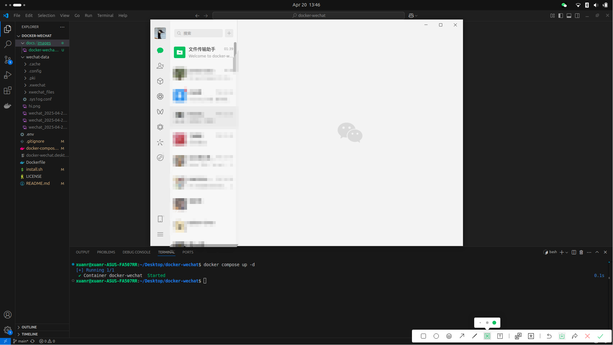

# docker-wechat

Run [WeChat](https://weixin.qq.com/) within a docker container without installing it onto the host!!!



## Features
**What works:** Tested on Ubuntu 24.04, almost everything works, including:
* GUI
* Messaging
* Voice calls
* Sending and saving files [^1]

**What doesn't work:**
* Camera access
* Drag and drop files from the host

[^1]: File sending and saving works only via the mounted `$WECHAT_DATA_DIR`.

## Getting started
### 1. Prerequisites
* A working Docker installation with Docker Compose.

### 2. Clone the repo
```bash
git clone https://github.com/xuanrui-work/docker-wechat docker-wechat
cd docker-wechat
```

### 3. Build the docker image
You can use `install.sh` which configures and build the docker image for you:
```bash
chmod +x ./install.sh
./install.sh
```

Alternatively, you can populate a `.env` file yourself with your configurations, similar to that done in [`install.sh`](./install.sh). And after that run
```
docker compose build
```

### 4. Run Wechat!
```bash
docker compose up -d
```

### 5. Optional: Add to launcher
```bash
REPO_PATH=$(pwd)
cat <<EOF > docker-wechat.desktop
[Desktop Entry]
Name=docker-wechat
Exec=bash -c "cd $REPO_PATH && docker compose up -d"
# Icon=/home/youruser/MyApp/myapp-icon.png
Type=Application
Terminal=false
StartupNotify=false
Categories=Utility;
EOF
rm ~/.local/share/applications/docker-wechat.desktop
ln -s $REPO_PATH/docker-wechat.desktop ~/.local/share/applications/docker-wechat.desktop
```
After this, docker-wechat should appear in your launcher's applications list.
